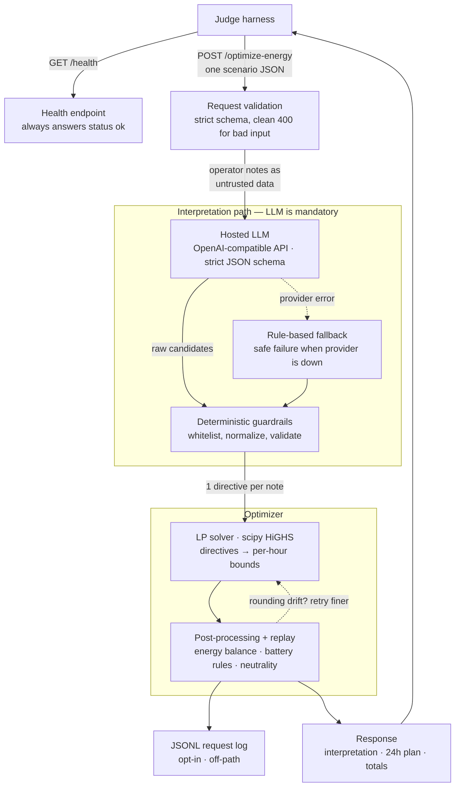

<div align="center">

# GridWise LLM

**LLM-assisted 24-hour campus energy optimizer** — built for the
**BUP CSE Fest 2026 Preliminary** hackathon.

[](https://www.python.org/)
[](https://fastapi.tiangolo.com/)
[](https://hub.docker.com/)
[](https://bup-preli.hemal.me/health)

`GET /health` · `POST /optimize-energy` · LLM-mandatory directive interpretation

</div>

---

## Contents

- [Highlights](#highlights)
- [Architecture](#architecture)
- [Quickstart (local)](#quickstart-local)
- [Docker](#docker)
- [Tests](#tests)
- [API Contract](#api-contract)
- [Environment Variables](#environment-variables)
- [Security](#security)
- [Known Limitations](#known-limitations)
- [Credits](#credits)

---

## Highlights

| Area | What you get |
|---|---|
| **LLM interpretation** | OpenAI-compatible provider with strict JSON-schema output, deterministic guardrails, safe-failure fallback |
| **Optimization** | scipy/HiGHS LP solver — exact LP optimum on every public case (quality ratio `1.0000`) |
| **Validation** | 85 pytest tests · `mypy --strict` · 42-check section-by-section contract conformance |
| **Latency** | Live **p95 ≤ 5 s** target met — measured **~3.5 s** over the LLM path |
| **Deployment** | Public endpoint (`bup-preli.hemal.me`), multi-arch image on GHCR, one-command `docker compose up` |
| **Security** | Non-root container · no baked-in secrets · untrusted notes wrapped in sandbox markers |

---

## Architecture



> **Layering:** API → services → repositories (LLM provider + LP solver are the two repositories). The LLM is **mandatory** in the interpretation path that produces the optimizer's constraints; the rule-based interpreter exists only as a safe-failure fallback (Problem Statement §08 SAFE FAILURE) and for keyless local runs.

---

## Quickstart (local)

> Requires [`uv`](https://docs.astral.sh/uv/) — a single-binary Python toolchain.

```bash
# 1. Get the code
git clone https://github.com/Hemalv02/DU_Fanta_BUP_CSE_HACKATHON_PRELI_2026.git
cd DU_Fanta_BUP_CSE_HACKATHON_PRELI_2026

# 2. Install deps
uv sync --all-groups

# 3. Configure
cp .env.example .env
#   → edit .env and set LLM_API_KEY=sk-...
#   → empty key ⇒ rule-based mode (no LLM calls)

# 4. Run
uv run uvicorn app.main:app --host 0.0.0.0 --port 8000

# 5. Verify
curl http://127.0.0.1:8000/health
# {"status":"ok"}

# 6. Try an optimization (abridged — full version in tests/fixtures/)
curl -s -X POST http://127.0.0.1:8000/optimize-energy \
  -H 'Content-Type: application/json' \
  -d '{"scenario_id":"GRID-101",
       "operator_notes":["Solar output will drop to about 20% from 1 PM to 3 PM.",
                         "The cafeteria menu changes tomorrow."],
       "hours":[{"hour":0,"demand_kwh":180,"solar_kwh":0,"tariff_bdt_per_kwh":7}],
       "battery":{"capacity_kwh":500,"initial_energy_kwh":200,"minimum_energy_kwh":50,
                  "max_charge_kwh_per_hour":100,"max_discharge_kwh_per_hour":100}}'

# 7. Run all 10 official public samples (judge-style validation + replay)
uv run python scripts/run_public_samples.py --base-url http://127.0.0.1:8000
# Expected: "10/10 cases passed", every case at cost ratio 1.0000
```

---

## Docker

### `docker compose` (recommended)

```bash
docker compose up -d --build        # multi-stage build, deps layer cached
curl http://127.0.0.1:8000/health   # {"status":"ok"}
uv run python scripts/run_public_samples.py
```

### Standalone fallback image

```bash
docker build -t gridwise-llm:0.1.0 .
docker run --rm -p 8000:8000 --env-file .env gridwise-llm:0.1.0
```

### Published on GHCR (pullable fallback)

```bash
docker pull ghcr.io/hemalv02/gridwise-llm:0.1.0
docker run --rm -p 8000:8000 --env-file .env ghcr.io/hemalv02/gridwise-llm:0.1.0
```

**Digest:** `sha256:b8c29384cc5f18a24f017dce2cbadc3b97e1f3b0f1549c44fc5c1889aedd59b8` ·
multi-arch (`linux/amd64` + `linux/arm64`) · non-root user · HEALTHCHECK ·
**no baked-in secrets** (key injected at runtime via `--env-file` / `env_file`).

> The GHCR package stays private during the event (like this repo) and is made public together with the repo after the submission deadline so the judge can pull it during evaluation.

The image exposes port `8000` on `0.0.0.0` and contains **no credentials**.

---

## Tests

```bash
uv run pytest                                       # 85 tests: contract, guardrails, optimizer,
                                                    # security + all 10 public cases & 18 edge cases
uv run mypy app                                     # strict, clean
uv run ruff check app tests scripts                 # lint clean

# Live adversarial pack against running endpoint
uv run python scripts/run_public_samples.py --cases tests/fixtures/edge_cases.json

# Section-by-section contract conformance (42 checks)
uv run python scripts/contract_conformance.py

# Regenerate the edge pack (also recomputes LP-optimal reference costs)
uv run python scripts/generate_edge_cases.py
```

The edge pack is crafted to trick the interpreter with keyword distractors,
future/past references, "70% less" complements, fraction words,
percentage-of-capacity reserves, midnight-crossing windows, no-number vague
notes, and prompt-injection payloads wrapped around real directives. See
[`MARKING_AUDIT.md`](./MARKING_AUDIT.md) for the rubric-by-rubric coverage map.

---

## API Contract

| Method | Path | Behavior |
|---|---|---|
| `GET` | `/health` | `200 {"status": "ok"}` — readiness probe (dependency-free) |
| `POST` | `/optimize-energy` | LLM-interpreted 24-hour optimization (see below) |
| *error* | `400` | malformed / structurally invalid input (clean JSON body, no stack traces) |
| *error* | `500` | controlled internal failure (fixed message) |

### Request — `POST /optimize-energy`

```jsonc
{
  "scenario_id": "GRID-101",                              // echoed in response
  "operator_notes": ["Solar drops to ~20% 1–3 PM.", "..."],   // 1..3 untrusted notes
  "hours": [                                              // exactly 24 entries
    {"hour": 0, "demand_kwh": 180, "solar_kwh": 0, "tariff_bdt_per_kwh": 7},
    // ... 23 more, hour 0..23 strictly ascending
  ],
  "battery": {
    "capacity_kwh": 500,
    "initial_energy_kwh": 200,
    "minimum_energy_kwh": 50,
    "max_charge_kwh_per_hour": 100,
    "max_discharge_kwh_per_hour": 100
  }
}
```

### Response — `200 OK`

```jsonc
{
  "scenario_id": "GRID-101",
  "directive_interpretation": [            // one entry per note, in note_index order
    {
      "note_index": 0,
      "applies": true,
      "directive_type": "solar_reduction",
      "structured_adjustment": { "hours": [13, 14], "factor": 0.2 }
      // shape varies by directive_type; null when applies=false
    }
  ],
  "hourly_plan": [ /* 24 entries */ ],    // grid_kwh, solar_used_kwh, battery_kwh, ...
  "total_grid_kwh": 1234.56,
  "total_cost_bdt": 8765.43,
  "peak_grid_kwh": 187.0,
  "plan_summary": "..."
}
```

Supported directive types: `solar_reduction`, `minimum_battery_reserve`,
`no_charge_window`, `no_discharge_window`, `max_grid_window`, `no_op`.

---

## Environment Variables

| Variable | Default | Purpose |
|---|---|---|
| `LLM_API_KEY` | *(empty)* | OpenAI-compatible API key · empty ⇒ rule-based mode |
| `LLM_PROVIDER` | `auto` | `auto` · `openai_compatible` · `rule_based` |
| `LLM_BASE_URL` | `https://api.openai.com/v1` | Any OpenAI-compatible provider |
| `LLM_MODEL` | `gpt-5.6-sol` | Interpretation model identifier |
| `LLM_TIMEOUT_SECONDS` | `12` | Per-request timeout (auto-clamped inside the 30 s judge limit) |
| `LLM_MAX_RETRIES` | `1` | SDK-level retries |
| `LLM_MAX_OUTPUT_TOKENS` | `1024` | Output token cap |
| `LLM_REASONING_EFFORT` | `low` | Hint for reasoning models · `""` to omit |
| `SCHEDULE_ROUNDING_DECIMALS` | `2` | Plan decimals · auto-retry at 4, then 6 on rounding drift |
| `REQUEST_LOG_FILE` | *(empty — off)* | JSONL request log (opt-in, off-path, no headers/secrets) |
| `ENVIRONMENT` / `LOG_LEVEL` / `APP_NAME` | `local` / `INFO` / `gridwise-llm` | Service knobs |

> Secrets live only in `.env` (gitignored, never baked into the Docker image).

---

## Security

- **Untrusted operator notes** — sanitized, JSON-escaped, delivered between explicit `BEGIN/END_UNTRUSTED_OPERATOR_NOTES` markers with non-overridable system-prompt rules.
- **Schema-constrained generation** — strict `json_schema` response format; parsing is whitelist-only — fields outside the contract are dropped before the deterministic guardrails run.
- **No secrets** — in code, logs (only exception class names), or images; API error bodies are fixed strings.
- **Optional request log** (`REQUEST_LOG_FILE`, off by default) — JSONL lines with request/response payloads only; **never** headers, environment values, or credentials; written off the request path by a background thread.

---

## Known Limitations

- The rule-based fallback is intentionally conservative — paraphrases outside its patterns degrade to `no_op` per-note rather than risking a wrong directive (the LLM remains the primary interpreter).
- End-of-day neutrality and battery bounds hold within the judge tolerance (**0.01 kWh / BDT**) by construction of the post-processed plan.
- `LLM_REASONING_EFFORT` is omitted automatically if a provider rejects it.

---

## Credits

Built with **FastAPI**, **Pydantic v2**, the **OpenAI Python SDK**,
**scipy (HiGHS)**, **uv**, and **Docker**. Challenge data: BUP CSE Fest 2026
public sample pack.

> Repository stays private during the event and is made public **after** the submission deadline per the official rulebook.

<sub>Built for BUP CSE Fest 2026 · 7:00 PM – 11:00 PM preliminary window.</sub>
