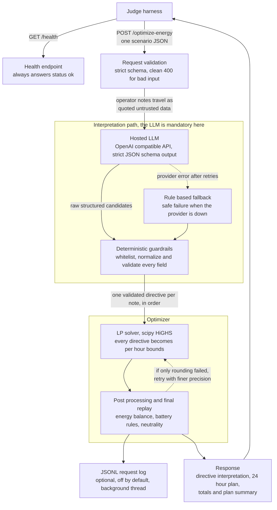

# GridWise LLM — BUP CSE Fest 2026 (Preliminary)

LLM-assisted operator-directive interpretation + 24-hour campus energy
optimization service, built to the canonical Problem Statement
(`GET /health`, `POST /optimize-energy`).

**Stack:** Python 3.12 · FastAPI · Pydantic v2 (strict schemas) · OpenAI SDK
(`gpt-5.6-sol`, structured outputs) · scipy/HiGHS LP solver · uv · Docker
(multi-stage).

---

## Architecture



Layering: **API → services → repositories** (repository = external
integration: LLM provider, LP solver). The LLM is mandatory and sits in the
interpretation path that produces the optimizer's constraints; a
deterministic rule-based interpreter exists only as a safe-failure fallback
(Section 08 SAFE FAILURE) and for keyless local runs.

## Quickstart (local, from clean environment)

```bash
# 0. Get the code
git clone <repository-url> gridwise-llm && cd gridwise-llm

# 1. Install (requires uv: https://docs.astral.sh/uv/)
uv sync --all-groups

# 2. Configure — copy and fill in your key
cp .env.example .env
#    LLM_API_KEY=sk-...        (empty -> rule-based mode, no LLM calls)

# 3. Run
uv run uvicorn app.main:app --host 0.0.0.0 --port 8000

# 4. Health check
curl http://127.0.0.1:8000/health
# {"status":"ok"}

# 5. One optimization request (abbreviated; the full 24-hour version is in
#    tests/fixtures/BUP_CSE_FEST_2026_Preli_Public_Sample_Cases.json)
curl -s -X POST http://127.0.0.1:8000/optimize-energy \
  -H 'Content-Type: application/json' \
  -d '{"scenario_id":"GRID-101",
       "operator_notes":["Solar output will drop to about 20% from 1 PM to 3 PM.",
                        "The cafeteria menu changes tomorrow."],
       "hours":[{"hour":0,"demand_kwh":180,"solar_kwh":0,"tariff_bdt_per_kwh":7}],"battery":{
         "capacity_kwh":500,"initial_energy_kwh":200,"minimum_energy_kwh":50,
         "max_charge_kwh_per_hour":100,"max_discharge_kwh_per_hour":100}}'
# -> {"scenario_id":"GRID-101","directive_interpretation":[...],"hourly_plan":[...24...],
#     "total_grid_kwh":...,"total_cost_bdt":...,"peak_grid_kwh":...,"plan_summary":"..."}

# 6. Run the 10 public sample cases (judge-style validation + replay)
uv run python scripts/run_public_samples.py --base-url http://127.0.0.1:8000
#    Expected result: "10/10 cases passed", every case at cost ratio 1.0000
#    (i.e. our schedule cost equals the reference optimum for each case).
```

## Environment variables

| Variable | Default | Purpose |
|---|---|---|
| `LLM_API_KEY` | *(empty)* | OpenAI-compatible API key; empty ⇒ rule-based mode |
| `LLM_BASE_URL` | `https://api.openai.com/v1` | Any OpenAI-compatible provider |
| `LLM_PROVIDER` | `auto` | `auto` (hosted model when a key is set), `openai_compatible`, or `rule_based` |
| `LLM_MODEL` | `gpt-5.6-sol` | Interpretation model |
| `LLM_TIMEOUT_SECONDS` | `12` | Per-request timeout (worst case `timeout x (retries+1)` is auto-clamped inside the 30 s judge limit) |
| `LLM_MAX_RETRIES` | `1` | SDK-level retries |
| `LLM_MAX_OUTPUT_TOKENS` | `4096` | Output token cap |
| `LLM_REASONING_EFFORT` | `low` | Latency hint for reasoning models (`""` to omit) |
| `SCHEDULE_ROUNDING_DECIMALS` | `2` | Decimal places in the returned plan; a plan that only fails replay due to rounding drift is automatically re-rounded finer (4, then 6) |
| `REQUEST_LOG_FILE` | *(empty — off)* | Enable JSONL logging of every `/optimize-energy` request+response (timestamp, status, latency, bodies). Written by a background thread — zero request-path I/O; no headers/secrets; `/health` not logged |
| `ENVIRONMENT` / `LOG_LEVEL` / `APP_NAME` | `local` / `INFO` / `gridwise-llm` | Service knobs |

Secrets live only in `.env` (gitignored, never baked into the Docker image).

## Docker

```bash
# Build (multi-stage: deps layer cached via uv; runtime is slim + non-root)
docker compose up -d --build

curl http://127.0.0.1:8000/health          # {"status": "ok"}

# Run the public samples against the container
uv run python scripts/run_public_samples.py

# Standalone fallback image (multi-arch: linux/amd64 + linux/arm64):
docker build -t gridwise-llm:0.1.0 .
docker run --rm -p 8000:8000 --env-file .env gridwise-llm:0.1.0

# Published fallback image on GHCR (exact tag and digest, no secrets baked in):
#   docker pull ghcr.io/hemalv02/gridwise-llm:0.1.0
#   docker run --rm -p 8000:8000 --env-file .env ghcr.io/hemalv02/gridwise-llm:0.1.0
# Digest: sha256:b8c29384cc5f18a24f017dce2cbadc3b97e1f3b0f1549c44fc5c1889aedd59b8
# The GHCR package is private during the event (like this repo) and is made
# public together with the repo after the submission deadline, so the judge
# can pull it during evaluation.
```

The image exposes port 8000 on 0.0.0.0, has a container HEALTHCHECK, runs as
a non-root user, and contains **no credentials** — the key is injected at
runtime (`--env-file` / compose `env_file`).

## Tests

```bash
uv run pytest        # 85 tests: contract, guardrails, optimizer, security,
                     # + all 10 public cases and 18 adversarial edge cases
                     # end-to-end with an independent judge-style replay
uv run mypy app      # strict, clean
uv run ruff check app tests scripts

# Live adversarial pack against the running LLM endpoint:
uv run python scripts/run_public_samples.py --cases tests/fixtures/edge_cases.json

# Section-by-section contract conformance (42 checks: input validation,
# output schema, physics replay, judge consistency rules):
uv run python scripts/contract_conformance.py

# Regenerate the edge pack (also recomputes LP-optimal reference costs):
uv run python scripts/generate_edge_cases.py
```

The edge pack (`tests/fixtures/edge_cases.json`) is crafted to trick the
interpreter: keyword distractors ("solar club meets", "battery safety
training"), future procurement, past references, reduction complements
("70% less"), fraction words, percentage-of-capacity reserves,
midnight-crossing windows, no-number vague notes, and prompt-injection
payloads wrapped around real directives. See `MARKING_AUDIT.md` for the
rubric-by-rubric coverage map.

## API contract (summary)

- `GET /health` → `200 {"status": "ok"}`
- `POST /optimize-energy` — request: `scenario_id`, `operator_notes[1..3]`,
  `hours[24] (hour, demand_kwh, solar_kwh, tariff_bdt_per_kwh)`, `battery
  (capacity_kwh, initial_energy_kwh, minimum_energy_kwh,
  max_charge_kwh_per_hour, max_discharge_kwh_per_hour)`.
  Response: `scenario_id`, `directive_interpretation[1/note]`, `hourly_plan[24]`,
  `total_grid_kwh`, `total_cost_bdt`, `peak_grid_kwh`, `plan_summary`.
- Errors: `400` malformed/structurally invalid (clean JSON body, no stack
  traces), `500` controlled internal failure.

## Security notes

- Operator notes are untrusted data: sanitized, JSON-escaped, and delivered
  between explicit `BEGIN/END_UNTRUSTED_OPERATOR_NOTES` markers with
  non-overridable security rules in the system prompt.
- Generation is schema-constrained (strict `json_schema` response format);
  parsing is whitelist-only — fields outside the contract are dropped before
  the deterministic guardrails run.
- No secrets in code, logs (only exception class names), or images; API error
  bodies are fixed strings.
- Optional request log (`REQUEST_LOG_FILE`, off by default): JSONL lines with
  request/response payloads only — never headers, environment values, or
  credentials — written off the request path by a background thread.

## Known limitations

- The rule-based fallback is intentionally conservative; paraphrases outside
  its patterns degrade to `no_op` per-note rather than risking a wrong
  directive (LLM remains the primary interpreter).
- End-of-day neutrality and battery bounds hold within the judge tolerance
  (0.01 kWh / BDT) by construction of the post-processed plan.
- `LLM_REASONING_EFFORT` is omitted automatically if a provider rejects it.

## Credits

Built with FastAPI, Pydantic, the OpenAI Python SDK, scipy (HiGHS), uv, and
Docker. Challenge data: BUP CSE Fest 2026 public sample pack.
